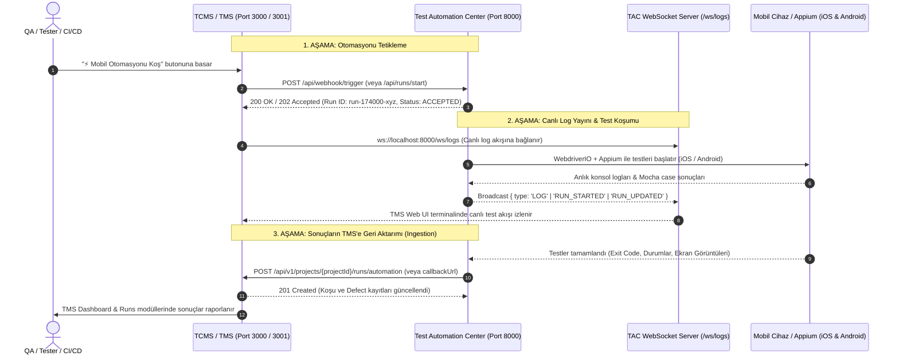

# 🚀 Test Automation Center (TAC) Entegrasyon Kılavuzu (API & Webhook & WebSocket)

Bu doküman, **TCMS / TMS (Test Case Management System)** projesinin **Test Automation Center (TAC - Port 8000)** ile çift yönlü (bi-directional) entegrasyon kurabilmesi, test senaryolarını tetikleyebilmesi, canlı log akışını (WebSocket) dinleyebilmesi, cihaz/spec envanterini sorgulayabilmesi ve sonuçları otomatik olarak alabilmesi için hazırlanmıştır.

---

## 🧭 Mimari ve Çift Yönlü Veri Akışı



---

## 🌐 Sunucu & Bağlantı Bilgileri

| Servis | Adres / URL | Açıklama |
| :--- | :--- | :--- |
| **TAC Base API** | `http://localhost:8000/api` | REST API kök adresi |
| **TAC Web Dashboard** | `http://localhost:8000` | TAC Görsel Kontrol Paneli (SPA) |
| **TAC Webhook Receiver** | `http://localhost:8000/api/webhook/trigger` | TMS Webhook tetikleme noktası |
| **TAC Canlı Log Akışı** | `ws://localhost:8000/ws/logs` | Canlı konsol ve koşu durum WebSocket'i |
| **Health Check** | `http://localhost:8000/api/health` | Sunucu sağlık ve durum kontrolü |

---

## 🔌 1. Test Koşumunu Tetikleme API'leri

TMS, Test Automation Center üzerinde test başlatmak için **Webhook** veya **Direct Run API** yöntemlerinden birini kullanabilir.

### A) TCMS Uyumlu Webhook Tetikleme (Önerilen)
TMS üzerindeki Webhook mekanizmasından fırlatılan standart isteği karşılar. Test senaryo kodları (`caseCodes`) veya spec dosya yolları (`specs`) ile dinamik eşleştirme yapar.

- **Metot:** `POST`
- **URL:** `http://localhost:8000/api/webhook/trigger`
- **Header:** `Content-Type: application/json`

#### TMS'ten Gönderilecek Webhook Payload Örneği:
```json
{
  "event": "AUTOMATION_TRIGGER",
  "project": {
    "id": "a1b2c3d4-e5f6-7890-abcd-ef1234567890",
    "key": "MOB",
    "name": "Mobil Bankacılık"
  },
  "testRun": {
    "id": "tcms-run-88231",
    "title": "Gece Regresyonu - iOS iPhone 15",
    "environment": "UAT",
    "version": "v2.4.0",
    "status": "IN_PROGRESS"
  },
  "scope": "SPECIFIC",
  "caseCodes": ["MOB-TC-1", "MOB-TC-2", "MOB-BENEFICIARY-1"],
  "platform": "iOS",
  "deviceAlias": "iphone15",
  "triggeredBy": "Ahmet Yılmaz (TMS)",
  "callbackUrl": "http://localhost:3001/api/v1/projects/a1b2c3d4-e5f6-7890-abcd-ef1234567890/runs/automation"
}
```

#### Alan Tanımları:
| Alan | Tip | Zorunlu? | Açıklama |
| :--- | :--- | :---: | :--- |
| `event` | `string` | **Evet** | Tetikleyici etkinlik adı (Örn: `AUTOMATION_TRIGGER`) |
| `project.id` | `string` | **Evet** | TMS tarafındaki proje UUID'si |
| `testRun.id` | `string` | Hayır | TMS tarafında açılan TestRun ID'si |
| `testRun.title`| `string` | Hayır | Koşu başlığı |
| `platform` | `enum` | Hayır | `'iOS'` veya `'Android'` (Varsayılan: `iOS`) |
| `deviceAlias` | `string` | Hayır | Hedef cihaz takma adı (Örn: `iphone15`, `iphone14`, `s24`, `emulator-5554`) |
| `scope` | `string` | Hayır | `'ALL'` veya `'SPECIFIC'` |
| `caseCodes` | `string[]` | Hayır | Koşulacak test case kodları (Otomatik spec dosyası ile eşleştirilir) |
| `specs` | `string[]` | Hayır | Doğrudan çalıştırılacak spec yolları (Örn: `["src/specs/pre_login/pre_login.spec.ts"]`) |
| `callbackUrl` | `string` | Hayır | Test bittiğinde sonuçların POST edileceği TMS Ingestion URL'i |
| `triggeredBy` | `string` | Hayır | Koşuyu başlatan kullanıcı / bot adı |

#### TAC Yanıtı (200 OK):
```json
{
  "status": "ACCEPTED",
  "message": "Test koşumu başarıyla başlatıldı (TCMS Run ID: tcms-run-88231)",
  "testRunId": "tcms-run-88231",
  "platform": "iOS",
  "specs": [
    "src/specs/pre_login/pre_login.spec.ts",
    "src/specs/transfers/tg04_defined_beneficiaries.spec.ts"
  ]
}
```

---

### B) Doğrudan Test Koşumu Başlatma API'si
- **Metot:** `POST`
- **URL:** `http://localhost:8000/api/runs/start`
- **Header:** `Content-Type: application/json`

#### İstek Gövdesi:
```json
{
  "title": "Smoke Regression Suite",
  "platform": "Android",
  "deviceAlias": "s24",
  "environment": "UAT",
  "specs": [
    "src/specs/pre_login/pre_login.spec.ts"
  ],
  "userAlias": "SELIN",
  "syncTcms": true,
  "tcmsProjectId": "a1b2c3d4-e5f6-7890-abcd-ef1234567890",
  "executedBy": "TMS Admin"
}
```

#### Yanıt (202 Accepted):
```json
{
  "success": true,
  "message": "Test run initiated",
  "data": {
    "id": "run-1740578123-abcde",
    "title": "Smoke Regression Suite",
    "platform": "Android",
    "deviceAlias": "s24",
    "environment": "UAT",
    "status": "RUNNING",
    "startTime": "2026-08-28T14:35:00.000Z",
    "logs": [],
    "results": [],
    "summary": { "total": 0, "passed": 0, "failed": 0, "skipped": 0 }
  }
}
```

---

## 📊 2. Koşu Durumu Sorgulama ve Yönetimi

### A) Tüm Koşuları Listeleme
- **Metot:** `GET`
- **URL:** `http://localhost:8000/api/runs`
- **Açıklama:** Son 100 koşunun durumunu, özet istatistiklerini ve sonuçlarını döner.

### B) Tek Bir Koşunun Detayını ve Canlı Sonuçlarını Alma
- **Metot:** `GET`
- **URL:** `http://localhost:8000/api/runs/{id}`

#### Örnek Yanıt:
```json
{
  "success": true,
  "data": {
    "id": "run-1740578123-abcde",
    "title": "Smoke Regression Suite",
    "platform": "Android",
    "deviceAlias": "s24",
    "environment": "UAT",
    "status": "PASSED",
    "startTime": "2026-08-28T14:35:00.000Z",
    "endTime": "2026-08-28T14:35:45.000Z",
    "durationMs": 45000,
    "summary": {
      "total": 2,
      "passed": 2,
      "failed": 0,
      "skipped": 0
    },
    "results": [
      {
        "caseCode": "MOB-TC-1",
        "status": "PASSED",
        "durationMs": 12400
      },
      {
        "caseCode": "MOB-TC-2",
        "status": "PASSED",
        "durationMs": 8500
      }
    ],
    "tcmsSynced": true,
    "tcmsRunId": "tcms-run-88231"
  }
}
```

### C) Çalışan Koşuyu Durdurma (Abort)
- **Metot:** `POST`
- **URL:** `http://localhost:8000/api/runs/{id}/stop`

---

## 📡 3. Canlı Log Yayını (WebSocket Stream)

TMS arayüzünde çalışan mobil testlerin anlık terminal çıktılarını ve durum güncellemelerini canlı göstermek için WebSocket sunucusuna bağlanabilirsiniz.

- **WebSocket URL:** `ws://localhost:8000/ws/logs`

### Gelen Olay (Event) Türleri:

#### 1. İlk Bağlantı:
```json
{
  "type": "CONNECTED",
  "message": "Connected to Live Test Logs Stream"
}
```

#### 2. Canlı Terminal / Appium Log Satırı (`LOG`):
```json
{
  "type": "LOG",
  "runId": "run-1740578123-abcde",
  "text": "[Appium] [XCUITest] Executing command 'click' on element...\n",
  "isError": false
}
```

#### 3. Koşu Başladı / Bitti / Güncellendi (`RUN_STARTED`, `RUN_FINISHED`, `RUN_UPDATED`):
```json
{
  "type": "RUN_FINISHED",
  "data": {
    "id": "run-1740578123-abcde",
    "status": "PASSED",
    "durationMs": 45000,
    "summary": { "total": 2, "passed": 2, "failed": 0, "skipped": 0 }
  }
}
```

---

## 🧪 4. Test Spec'leri ve Test Planları Envanteri

TMS, TAC projesinde kayıtlı olan tüm test dosyalarını, içerdikleri test case kodlarını (`MOB-TC-X`) ve hazır test planlarını dinamik olarak çekebilir.

### A) Tüm Spec Dosyalarını ve İçerdikleri Senaryoları Listeleme
- **Metot:** `GET`
- **URL:** `http://localhost:8000/api/specs`

#### Örnek Yanıt:
```json
{
  "success": true,
  "count": 4,
  "data": [
    {
      "name": "pre_login.spec.ts",
      "relativePath": "src/specs/pre_login/pre_login.spec.ts",
      "category": "pre_login",
      "suites": ["Pre-Login Flow Tests"],
      "cases": [
        { "title": "[MOB-TC-1] Uygulama açılış kontrolü", "code": "MOB-TC-1", "line": 14 },
        { "title": "[MOB-TC-2] Dil seçimi ve bildirim izni", "code": "MOB-TC-2", "line": 28 }
      ]
    },
    {
      "name": "tg04_defined_beneficiaries.spec.ts",
      "relativePath": "src/specs/transfers/tg04_defined_beneficiaries.spec.ts",
      "category": "transfers",
      "suites": ["Transfer - Tanımlı Alıcılar Test Suite"],
      "cases": [
        { "title": "[MOB-BENEFICIARY-1] Kayıtlı alıcı listeleme", "code": "MOB-BENEFICIARY-1", "line": 20 }
      ]
    }
  ]
}
```

### B) Hazır Test Planlarını Listeleme & Yönetme
- **`GET /api/specs/plans`**: Tanımlı test paketlerini getirir (Smoke iOS, Smoke Android, Pilot Regression vb.)
- **`POST /api/specs/plans`**: TMS üzerinden yeni bir test planı kaydeder.
- **`PUT /api/specs/plans/{id}`**: Test planını günceller.
- **`DELETE /api/specs/plans/{id}`**: Test planını siler.

---

## 📱 5. Cihaz Envanteri ve Donanım Taraması

TMS, test başlatmadan önce hangi fiziksel telefonların ve emülatörlerin bağlı olduğunu sorgulayabilir.

### A) Kayıtlı Cihaz Kataloğu
- **Metot:** `GET`
- **URL:** `http://localhost:8000/api/devices`
- Tanımlı tüm iOS & Android cihazların UDID, model, Appium Port, WDA Port ve MJPEG Port bilgilerini döner.

### B) Canlı USB & Emülatör Taraması (Live Scan)
- **Metot:** `GET`
- **URL:** `http://localhost:8000/api/devices/scan`
- `adb devices` ve `xcrun simctl` / `idevice_id` komutlarını canlı koşturarak o an makineye bağlı tüm aktif cihazları tespit eder ve katalogla eşleştirir.

#### Örnek Yanıt:
```json
{
  "success": true,
  "scannedCount": 2,
  "data": [
    {
      "udid": "00008120-001A24E22E43A01E",
      "name": "iPhone 15",
      "platform": "iOS",
      "state": "device",
      "isConfigured": true,
      "alias": "iphone15"
    },
    {
      "udid": "emulator-5554",
      "name": "Pixel 8 Pro Android 14",
      "platform": "Android",
      "state": "device",
      "isConfigured": true,
      "alias": "emulator-5554"
    }
  ]
}
```

### C) Appium Sunucu Sağlık Kontrolü
- **Metot:** `POST`
- **URL:** `http://localhost:8000/api/devices/health`
- **Payload:** `{ "port": 4731 }` veya `{ "url": "http://localhost:4731" }`

---

## 🐛 6. Defect (Hata Kaydı) Yönetimi API'si

TAC üzerinde oluşan test hataları ve Jira entegrasyonları TMS tarafından sorgulanabilir ve yönetilebilir.

- **`GET /api/defects`**: Loglanmış tüm hataları listeler.
- **`POST /api/defects`**: Yeni bir hata kaydı oluşturur (Jira Key, Case Code, Base64 Ekran Görüntüsü ile).
- **`PUT /api/defects/{id}`**: Durum günceller (`OPEN`, `IN_PROGRESS`, `RESOLVED`, `CLOSED`).
- **`DELETE /api/defects/{id}`**: Hata kaydını siler.

---

## 💻 TMS Projesi İçin Hazır Entegrasyon Kodları (Code Snippets)

### A) TypeScript / Node.js (TMS Backend Servisi İçin Axios İstemcisi)

```typescript
import axios from 'axios';

export class TACService {
  private tacBaseUrl = process.env.TAC_URL || 'http://localhost:8000';

  /**
   * 1. TAC üzerinde test koşumu başlatır
   */
  async triggerMobileAutomation(params: {
    projectId: string;
    testRunId: string;
    title: string;
    platform: 'iOS' | 'Android';
    deviceAlias?: string;
    caseCodes?: string[];
    callbackUrl?: string;
  }) {
    const payload = {
      event: 'AUTOMATION_TRIGGER',
      project: { id: params.projectId, key: 'MOB', name: 'Mobile Banking' },
      testRun: {
        id: params.testRunId,
        title: params.title,
        environment: 'UAT',
        version: 'v2.4.0',
        status: 'IN_PROGRESS'
      },
      scope: params.caseCodes?.length ? 'SPECIFIC' : 'ALL',
      caseCodes: params.caseCodes,
      platform: params.platform,
      deviceAlias: params.deviceAlias,
      triggeredBy: 'TMS Automation Engine',
      callbackUrl: params.callbackUrl
    };

    const response = await axios.post(`${this.tacBaseUrl}/api/webhook/trigger`, payload, {
      headers: { 'Content-Type': 'application/json' },
      timeout: 10000
    });

    return response.data;
  }

  /**
   * 2. TAC'ta mevcut spec'leri ve case kodlarını sorgular
   */
  async getAvailableSpecs() {
    const response = await axios.get(`${this.tacBaseUrl}/api/specs`);
    return response.data.data;
  }

  /**
   * 3. Bağlı aktif cihazları sorgular
   */
  async getConnectedDevices() {
    const response = await axios.get(`${this.tacBaseUrl}/api/devices/scan`);
    return response.data.data;
  }

  /**
   * 4. Koşu durumunu sorgular
   */
  async getRunStatus(runId: string) {
    const response = await axios.get(`${this.tacBaseUrl}/api/runs/${runId}`);
    return response.data.data;
  }
}

export const tacService = new TACService();
```

---

### B) WebSocket Canlı Log Dinleyicisi (TypeScript / Browser & Node.js)

```typescript
export function subscribeToTACLogs(
  onLog: (text: string) => void,
  onStatusChange?: (data: any) => void
): WebSocket {
  const ws = new WebSocket('ws://localhost:8000/ws/logs');

  ws.onopen = () => {
    console.log('✅ Connected to TAC Live Logs Stream');
  };

  ws.onmessage = (event) => {
    try {
      const msg = JSON.parse(event.data);
      if (msg.type === 'LOG' && msg.text) {
        onLog(msg.text);
      } else if (msg.type === 'RUN_FINISHED' || msg.type === 'RUN_STARTED') {
        if (onStatusChange) onStatusChange(msg.data);
      }
    } catch (e) {
      console.error('WS Parse Error:', e);
    }
  };

  ws.onerror = (err) => {
    console.error('TAC WS Error:', err);
  };

  return ws;
}
```

---

### C) cURL Test Komutları

#### 1. Webhook ile Test Tetikleme:
```bash
curl -X POST "http://localhost:8000/api/webhook/trigger" \
  -H "Content-Type: application/json" \
  -d '{
    "event": "AUTOMATION_TRIGGER",
    "project": { "id": "proj-123", "name": "Mobile Banking" },
    "testRun": { "id": "run-99", "title": "cURL Trigger Test" },
    "platform": "iOS",
    "deviceAlias": "iphone15",
    "caseCodes": ["MOB-TC-1"],
    "callbackUrl": "http://localhost:3001/api/v1/projects/proj-123/runs/automation"
  }'
```

#### 2. Canlı Bağlı Cihazları Listeleme:
```bash
curl -s "http://localhost:8000/api/devices/scan" | jq .
```

#### 3. Mevcut Test Senaryolarını Listeleme:
```bash
curl -s "http://localhost:8000/api/specs" | jq .
```

---

## ⚙️ Desteklenen Platformlar ve Cihaz Alias Tablosu

TAC içerisinde önceden tanımlanmış cihazlar ve port konfigürasyonları:

| Platform | Cihaz Alias | Model / Açıklama | UDID | Appium Port | WDA Port |
| :--- | :--- | :--- | :--- | :--- | :--- |
| **iOS** | `iphone15` | Fiziksel iPhone 15 | `00008120-001A24E22E43A01E` | `4731` | `8100` |
| **iOS** | `iphone14` | Fiziksel iPhone 14 | `00008110-00123C923C39A01E` | `4732` | `8101` |
| **Android** | `s24` | Fiziksel Samsung S24 | `R5CX123456` | `4723` | `-` |
| **Android** | `emulator-5554` | Android 14 Pixel 8 Pro | `emulator-5554` | `4725` | `-` |

> 💡 **Not:** Yeni bir cihaz eklendiğinde `http://localhost:8000/api/devices` endpoint'ine `POST` isteği atılarak veya TAC arayüzündeki Cihaz Yönetimi ekranından anında tanımlanabilir.
